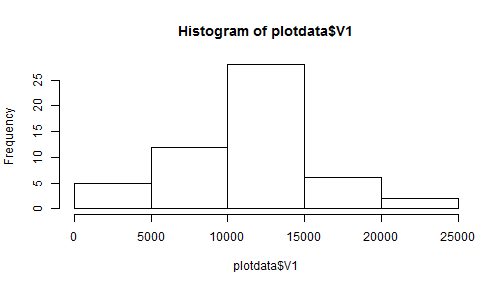
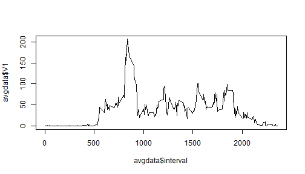
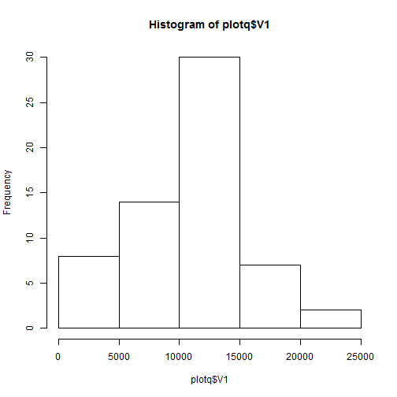
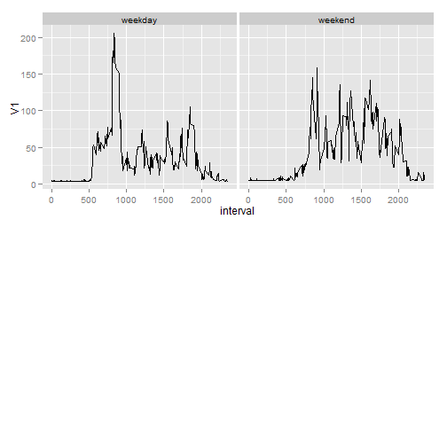

# Reproducible Research: Peer Assessment 1


## Loading and preprocessing the data


```r
activdata<-read.csv("activity.csv", colClasses = c("numeric", "Date", "numeric"))
head(activdata)
```

```
##   steps       date interval
## 1    NA 2012-10-01        0
## 2    NA 2012-10-01        5
## 3    NA 2012-10-01       10
## 4    NA 2012-10-01       15
## 5    NA 2012-10-01       20
## 6    NA 2012-10-01       25
```


## What is mean total number of steps taken per day?

```r
library(data.table)
activtable<-data.table(activdata)
plotdata<-na.omit(activtable[,sum(steps), by = "date"])
hist(plotdata$V1)
```

 

```r
meandata<-mean(plotdata$V1, na.rm=T)
meddata<-median(plotdata$V1, na.rm=T)
print(meandata)
```

```
## [1] 10766
```

```r
print(meddata)
```

```
## [1] 10765
```

## What is the average daily activity pattern?

```r
cleandata<-na.omit(activtable)
avgdata<-cleandata[,mean(steps), by = "interval"]
plot(avgdata$interval,avgdata$V1, type ="l")
```

 

```r
m<-max(avgdata$V1)
maximumd<-subset(avgdata, avgdata$V1 == m) 
print(maximumd)
```

```
##    interval    V1
## 1:      835 206.2
```
## Imputing missing values


```r
activdata<-read.csv("activity.csv", colClasses = c("numeric", "Date", "numeric"))
nasum<-sum(is.na(activdata))
print(nasum)
```

```
## [1] 2304
```

```r
activdata<-read.csv("activity.csv", colClasses = c("numeric", "Date", "numeric"))
library(zoo)
```

```
## 
## Attaching package: 'zoo'
## 
## The following objects are masked from 'package:base':
## 
##     as.Date, as.Date.numeric
```

```r
fulltable<-activdata
fulltable[1:10,1]<-0
z<-zoo(fulltable[,1], as.Date(fulltable$date), fulltable$interval)

w<-weekdays(fulltable$date)


fulltable<-na.aggregate(z, format, "%d", FUN = mean, na.rm=T)
fulltab<-as.data.frame(fulltable)
activtab<-activdata[,2:3]
finaltab<-cbind(fulltab, activtab)
colnames(finaltab)<-c("steps", "date", "interval")


library(data.table)
activq<-data.table(finaltab)
plotq<-na.omit(activq[,sum(steps), by = "date"])
hist(plotq$V1)
```

 

```r
meanq<-mean(plotq$V1, na.rm=T)
medq<-median(plotq$V1, na.rm=T)
print(meanq)
```

```
## [1] 10386
```

```r
print(medq)
```

```
## [1] 10600
```
### The value after repalcing NA are lower than earlier as some zeros are included in overall mean to lower the mean and median

## Are there differences in activity patterns between weekdays and weekends?


```r
p<-nrow(finaltab)


for (i in 1:p){
  
if(weekdays(finaltab[i,2]) == "Saturday"){
  
finaltab[i,4]<-"weekend"
}
else{
  if(weekdays(finaltab[i,2]) == "Sunday"){
    finaltab[i,4]<-"weekend"
    }
  else{
finaltab[i,4]<-"weekday"
}
}
}

library(data.table)
library(ggplot2)
library(reshape2)
library(gridExtra)
```

```
## Loading required package: grid
```

```r
finalq<-data.table(finaltab)
plotq<-finalq[,mean(steps), by = "interval,V4"]
f<-ggplot(plotq) + facet_grid(~V4, as.table =T) + geom_line(aes(x=interval, y=V1, group = V4))
grid.arrange(f, nrow=2)
```

 
